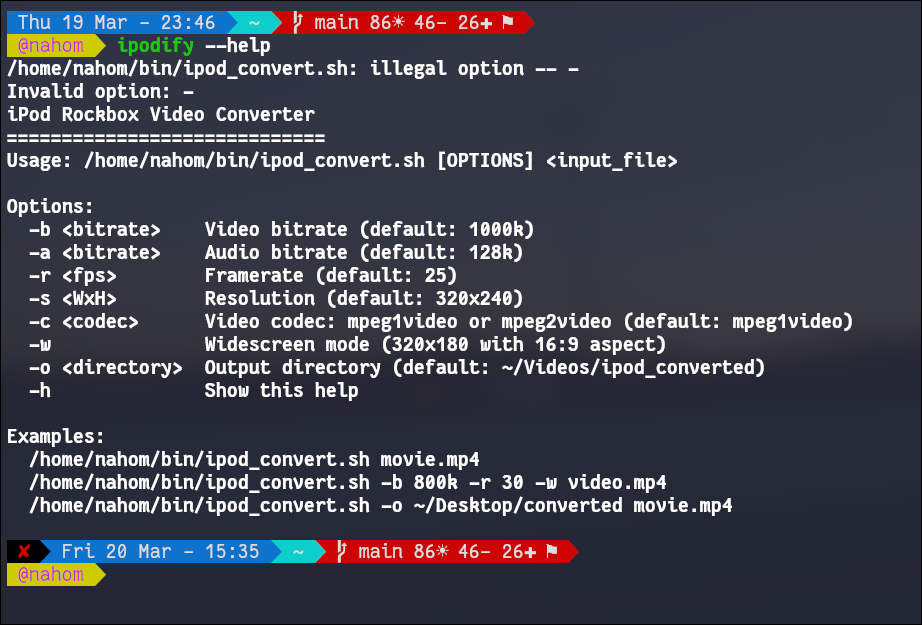

A simple bash script that converts regular video files to the MPEG-1/2 format required for smooth playback on iPod Classic (5th/6th/7th gen) devices running Rockbox firmware.

No more memorizing ffmpeg flags—just point it at a video and get a working .mpg file ready to copy to your iPod.

Features:
- Automatic resolution scaling (320x240 default, 320x180 for widescreen)
- Configurable video/audio bitrates
- Preserves original audio as MP2
- Shows output file info after conversion

Here is a Picture: 

More Converters Coming Soon!
